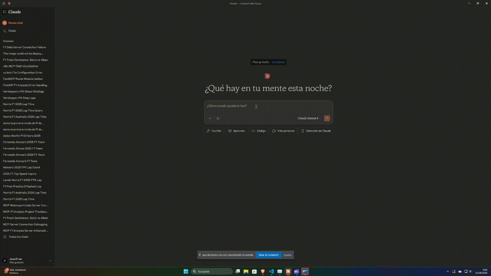

# 🏎️ MCP Server F1Data



A Model Context Protocol (MCP) server for interacting with F1Data through LLM interfaces like Claude. **You will need to have Claude installed on your system to continue.**

## Getting Started
First of all, you need to install `mcp-f1data` package from pypi with pip, using the following command:
```commandline
pip install mcp-f1data
```

To use `mcp-f1data` server in claude can be configured by adding the following to your configuration file.
- Windows: `%APPDATA%/Claude/claude_desktop_config.json`
- Linux: `~/Library/Application Support/Claude/claude_desktop_config.json`

Add the F1Data MCP server configuration:
```json
{
  "mcpServers": {
    "mcp-f1data": {
        "command": "python",
        "args": [ "-m", "mcp-f1data" ]
    }
  }
}
```

## Tools 
- `circuit`
- `constructor`
- `driver`
- `grand prix`
- `manufacturer`
- `race`
- `season`

## Instalation
Active the virtual environment and install the requirements using:
```commandline
.\.venv\Scripts\activate
```

Install the mcp server in Claude using the following command:
```commandline
mcp install .\server.py
```

## Requirements
The requirementes used to build this MCP server are:
- `fastf1`
- `pandas`
- `fastmcp`
- `websockets`
- `mcp`
- `pydantic`
- `fastapi`

## Testing 
You can test the server using the MCP Inspector:
```commandline
mcp dev .\server.py
```

## 📜 Licenses

### Source Code
The source code of this project is licensed under the [Apache License 2.0](./LICENSE).

### Data
This project uses Formula 1 data from [**F1DB**](https://github.com/f1db/f1db) 
created by the F1DB contributors, licensed under the 
[Creative Commons Attribution 4.0 International (CC BY 4.0)](https://creativecommons.org/licenses/by/4.0/) license.

The original data has been:
- Imported and structured into a PostgreSQL database
- Exposed through a custom REST API
- Optimized for efficient querying

The original data is provided "as-is" without warranties of any kind, 
as per the terms of the CC BY 4.0 license.

For complete attribution details, see [ATTRIBUTIONS.md](./ATTRIBUTIONS.md)..

## Notice
F1Analisys is unofficial and are not associated in any way with the Formula 1 companies. F1, FORMULA ONE, FORMULA 1, FIA FORMULA ONE WORLD CHAMPIONSHIP, GRAND PRIX and related marks are trade marks of Formula One Licensing B.V.